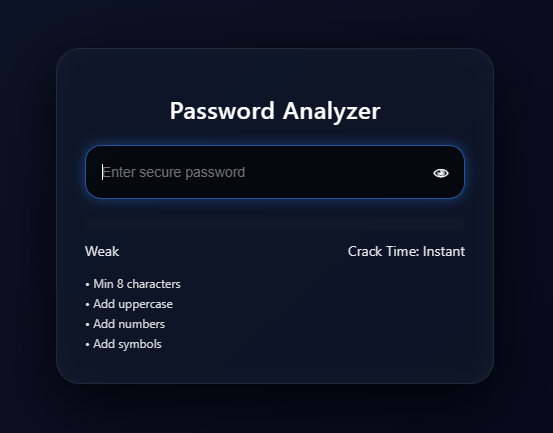

# 🔐 Password Analyzer

A modern, real-time password strength checker built with **HTML, CSS, and JavaScript**.

This project focuses on **clean UI, responsive design, and instant feedback**, simulating how modern authentication systems guide users to create stronger passwords.

---

## 🚀 Features

- 🔍 Real-time password strength analysis
- 📊 Dynamic strength indicator (Weak / Medium / Strong)
- ⏳ Crack time estimation (simulated)
- 💡 Smart suggestions for improving passwords
- 👁️ Show/Hide password toggle
- 🎨 Premium glassmorphism UI
- 📱 Fully responsive design

---

---

## 🧠 How It Works

The analyzer evaluates passwords based on:

- Length (8+ / 12+ characters)
- Uppercase & lowercase letters
- Numbers
- Special characters
- Pattern detection (e.g., `123`, `abc`, repeated characters)

Based on these factors, it calculates a **score** and updates:
- Strength level
- Crack time estimation
- Improvement suggestions

---

## ⚠️ Note

Crack time is **not cryptographically accurate**.  
It is a **visual estimation** designed to improve user awareness.

---

## 🛠️ Tech Stack

- HTML5
- CSS3 (Glassmorphism + Animations)
- Vanilla JavaScript

---

## 📂 Project Structure

├── index.html
├── style.css
├── script.js

---

## 💡 Future Improvements

- Entropy-based strength calculation
- Integration with zxcvbn library
- Breach detection (HaveIBeenPwned API)
- Dark/Light theme toggle
- Advanced animations

---

## 📸 Preview

---

## 📌 Author

VIJAY

